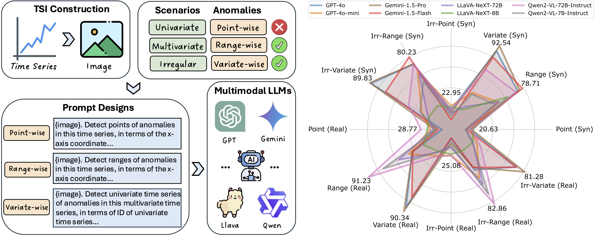

# Can Multimodal LLMs Perform Time Series Anomaly Detection?
This repo includes the official code and datasets for paper ["Can Multimodal LLMs Perform Time Series Anomaly Detection?"](https://arxiv.org/abs/2502.17812)

## 🕵️‍♂️ VisualTimeAnomaly
<div align="center">

</div>

<p align="center"><b><font size="70">Left: the workflow of VisualTimeAnomaly. Right: the performance comparison across various setting.</font></b></p>

## 🏆 Contributions
- The first comprehensive benchmark for multimodal LLMs (MLLMs) in time series anomaly detection (TSAD), covering diverse scenarios (univariate, multivariate, irregular) and varying anomaly granularities (point-, range-, variate-wise).
- Several critical insights significantly advance the understanding of both MLLMs and TSAD.
- We construct a large-scale dataset including 12.4k time series images, and release the dateset and code to foster future research.

## 🔎 Findings
- MLLMs detect range- and variate-wise anomalies more effectively than point-wise anomalies;
- MLLMs are highly robust to irregular time series, even with 25% of the data missing;
- Open-source MLLMs perform comparably to proprietary models in TSAD. While open-source MLLMs excel on univariate time series, proprietary MLLMs demonstrate superior effectiveness on multivariate time series.

## ⚙️ Getting Started
### Environment
* python               3.10.14
* torch                2.4.1
* numpy                1.26.4
* transformers         4.49.0.dev0
* huggingface-hub      0.24.7
* openai               1.44.0
* google-generativeai  0.8.3

### Dataset
Enter `src` folder.

If you want to generate all datasets, execute the below script:

`./generator.sh`

If you want to generate a specific dataset, execute the below script:

`python generator.py --category $category --scenario $scenario --anomaly_type $anomaly_type --num_ts $num_ts`.

For example, generate 100 univaraite time series images for global anomalies:

`python generator.py --category synthetic --scenario univariate --anomaly_type global --num_ts 100`

### Run 
Enter `src` folder.

If you want to run MLLMs on all datasets, execute the below script:

`./test.sh`

If you want to run a MLLM on a specific dataset, execute the below script:

`python main.py --category $category --scenario $scenario --model_name $model_name --data $data`

For example, run GPT-4o on univaraite time series scenario with global anomalies:

`python main.py --category synthetic --scenario univariate --model_name gpt-4o --data global`

## Acknowledgement
We sincerely appreciate the following github repo for the code base and datasets:

https://github.com/Rose-STL-Lab/AnomLLM

https://github.com/datamllab/tods/tree/benchmark

## 📝 Citation  
If you find our work useful, please cite the below paper:
```bibtex
@article{xu2025can,
  title={Can Multimodal LLMs Perform Time Series Anomaly Detection?},
  author={Xu, Xiongxiao and Wang, Haoran and Liang, Yueqing and Yu, Philip S and Zhao, Yue and Shu, Kai},
  journal={arXiv preprint arXiv:2502.17812},
  year={2025}
}
```
